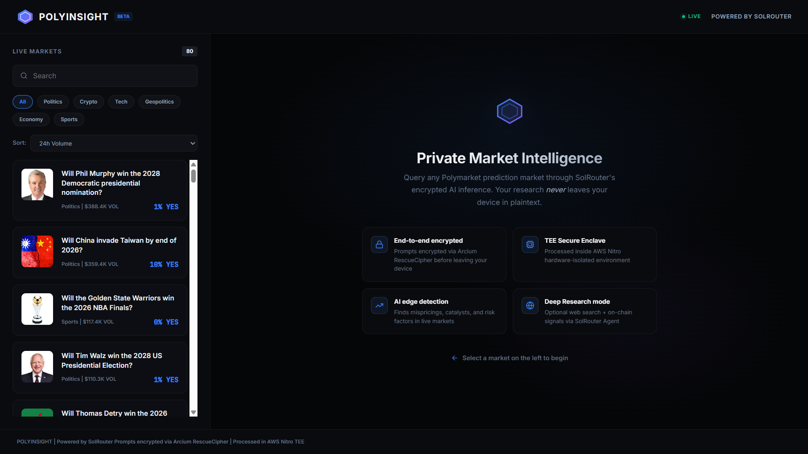
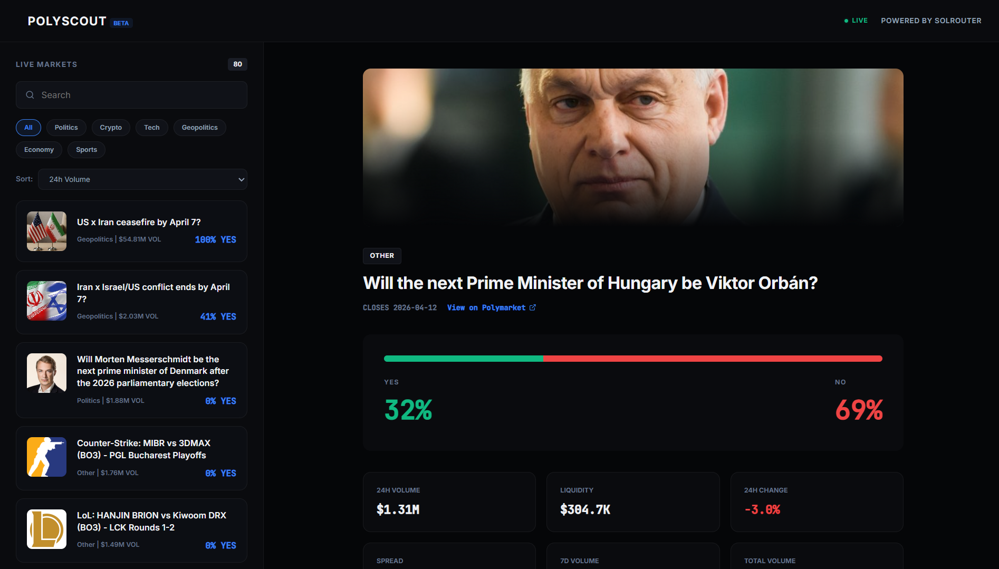
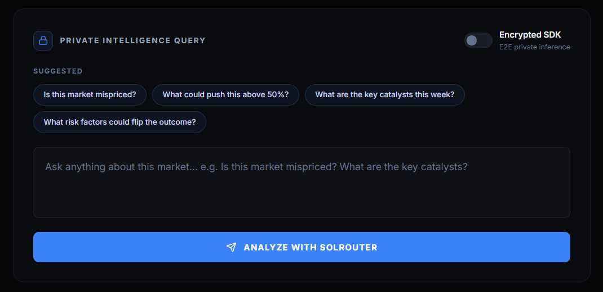
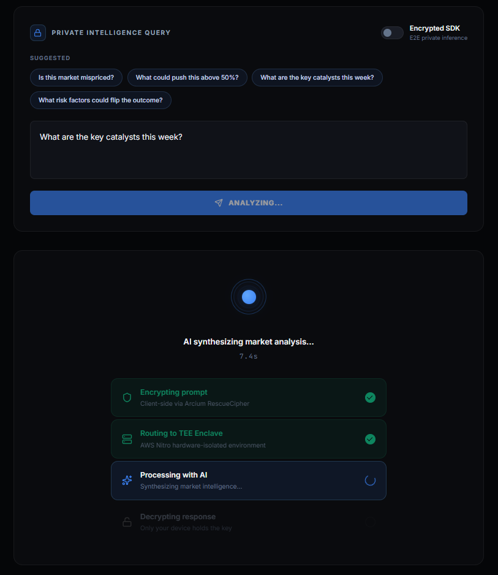

# PolyInsight - Private Polymarket Research Agent

> **Analyze Polymarket prediction markets through SolRouter's encrypted AI inference. Your research stays completely private, encrypted before it leaves your device, processed inside hardware-isolated TEE, routed through Solana.**

---

## Why Private Inference?

Prediction market research is sensitive. If you're quietly investigating a specific political, crypto, or geopolitical market, your research trail: the questions asked, the edges being tested is as strategic as the trade itself.

Standard AI tools log every prompt. SolRouter doesn't because of math, not policy.

| Standard AI | SolRouter |
|-------------|-----------|
| Prompts stored on provider servers | Encrypted client-side (Arcium RescueCipher) |
| Provider can read your queries | Processed in AWS Nitro TEE (hardware isolation) |
| Research trail exposed | Zero knowledge. Verifiable. |
| KYC required | Wallet connect only, no PII |

---

## Features

- **End-to-end encrypted inference** via @solrouter/sdk
- **Live Polymarket data**: real odds, volume, liquidity, price trends, and images
- **Deep Research Agent**: optional web search + on-chain signals via SolRouter Agent
- **Market browser**: search and filter active prediction markets
- **Web UI + CLI**: browser dashboard or terminal, your choice
- **Edge detection**: AI analyzes whether current odds are mispriced

---

## Quick Start

### 1. Clone & Install

```bash
git clone https://github.com/VivekNakrani/PolyInsight
cd PolyInsight
npm install
```

### 2. Get a SolRouter API Key

1. Go to [app.solrouter.com](https://www.solrouter.com/sdk)
2. Connect your Solana wallet
3. Get your API key

### 3. Configure

```bash
cp .env.example .env
# Edit .env and add your SOLROUTER_API_KEY
```

### 4. Run

```bash
npm start
# Open http://localhost:3000
```

---

## Using the Web UI

1. Open http://localhost:3000
2. Browse the live Polymarket markets in the left panel
3. Search or filter by category (Politics, Crypto, Tech, etc.)
4. Click a market to see live odds and stats
5. Type a research question (or leave blank for a general analysis)
6. Toggle **Deep Research** to enable the live agent research
7. Click **Analyze with SolRouter** — your query is encrypted before transmission

---

## Using the CLI

```bash
# Basic analysis (encrypted SDK inference)
node cli.js "Will Claude 5 be released by April 30, 2026?"

# With web search tools
node cli.js "Will Claude 5 be released by April 30, 2026?" --tools
```

Example output:

```
PolyInsight CLI
------------

Searching: "Will Claude 5 be released by April 30, 2026?"

Market: Will Claude 5 be released by April 30, 2026?
YES: 59% | NO: 42%
Volume: $0.66M
URL: https://polymarket.com/event/claude-5-released-by

Mode: Encrypted SDK (E2E encrypted)

------------------------------------------------------------
ANALYSIS
------------------------------------------------------------
**1. Market Summary**  
- **Event**: “Will Claude 5 be released by April 30, 2026?” (Polymarket, Tech category).  
- **Consensus**: 59 % probability of “Yes” (price $0.585), 41 % 

(and so on....)
```
---


## How It Works

```
Your Device (Browser/Node)
    │
    ├── @solrouter/sdk encrypts prompt with X25519 key exchange (Arcium RescueCipher)
    │
    ▼
    SolRouter Backend
    │
    ├── Receives encrypted blob — cannot decrypt, routes blind
    │
    ▼
AWS Nitro TEE (Hardware Isolated Enclave)
    │
    ├── Decrypts prompt inside secure enclave
    ├── Calls AI model (GPT-4o, Claude, Gemini, etc.)
    ├── Encrypts response with ephemeral key
    │
    ▼
Your Device
    │
    └── Decrypts response — only you see it
```

**Privacy guarantee**: Neither SolRouter nor any intermediary ever sees your research queries in plaintext. This is enforced by hardware, not policy.

---

## Architecture

```
PolyInsight/
├── server.js              Express backend (markets API + analysis proxy)
├── agent/
│   ├── polymarket.js      Polymarket Gamma API client (live market data)
│   └── solrouter.js       SolRouter SDK wrapper (encrypted inference)
├── public/
│   ├── index.html         Web UI
│   ├── style.css          Dark glassmorphism styling
│   └── app.js             Frontend logic
├── cli.js                 Terminal interface
├── .env.example           Environment template
├── .env.production.example Production setup
└── package.json
```

**APIs used:**
- `gamma-api.polymarket.com/markets` -> live market data, no auth required
- `@solrouter/sdk` -> encrypted AI inference 
- `api.solrouter.com/agent` -> tool-augmented research (web search + on-chain)

---

## SolRouter Integration

The SDK integration is in [`agent/solrouter.js`](./agent/solrouter.js):

```js
import { SolRouter } from '@solrouter/sdk';

const client = new SolRouter({ apiKey: process.env.SOLROUTER_API_KEY });

// Encrypted by default — backend never sees your prompt
const response = await client.chat(prompt);
console.log(response.message);
```

For tool-augmented research (web search + on-chain signals), we use the Agent API:

```js
const res = await fetch('https://api.solrouter.com/agent', {
  method: 'POST',
  headers: { 'Authorization': `Bearer ${apiKey}` },
  body: JSON.stringify({ prompt, model: 'gpt-4o-mini', useTools: true }),
});
```

---

## Demo

### Home Dashboard


### Market View


### Intelligence Query


### AI Analysis Output


---

## SolRouter Account

This project was built using a real SolRouter account (wallet-connected, funded with devnet USDC).
Telegram: [@vivekn37](http://t.me/vivekn37)

---

## Built With

- [SolRouter](https://solrouter.com) -> Private AI inference infrastructure
- [Polymarket](https://polymarket.com) -> Prediction market data
- Node.js + Express -> Backend server
- Vanilla HTML/CSS/JS -> Frontend (no framework needed)

---

## License

MIT